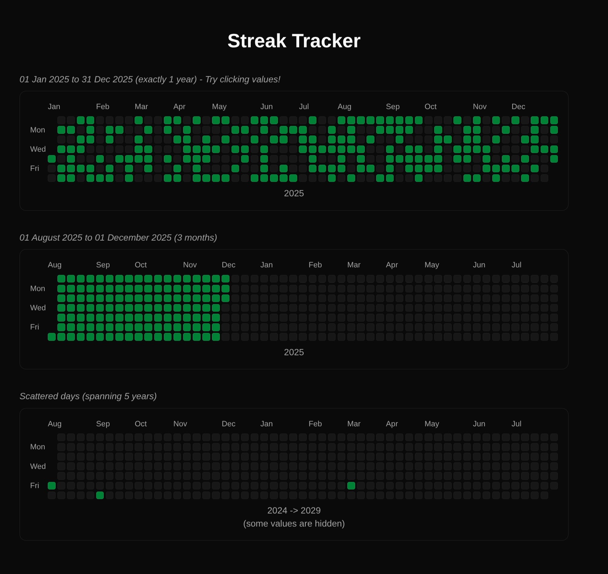

## Github-like Streak tracker

A fun sideproject for a react component I'll need in another project.

### Features

- Simple api - takes values in, spits 'em out when a box is clicked. Only works in controlled mode.
- No dependencies on date-fns or other date libs

### Dependencies

- React
- RadixUI Tooltip
- `clsx`

